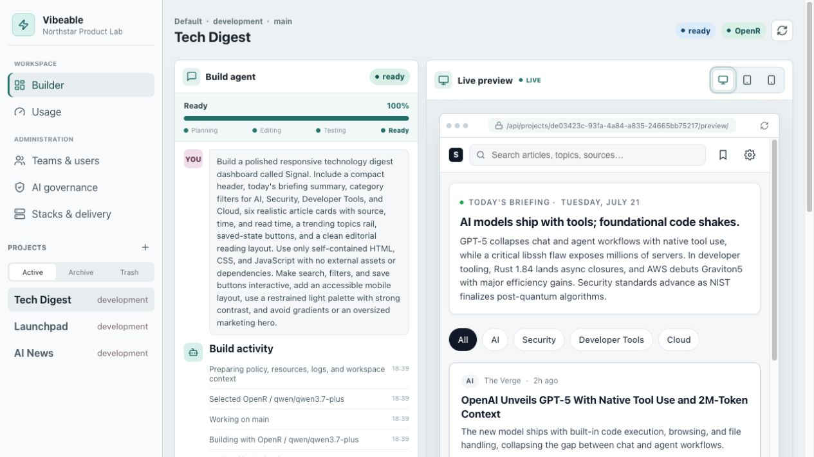
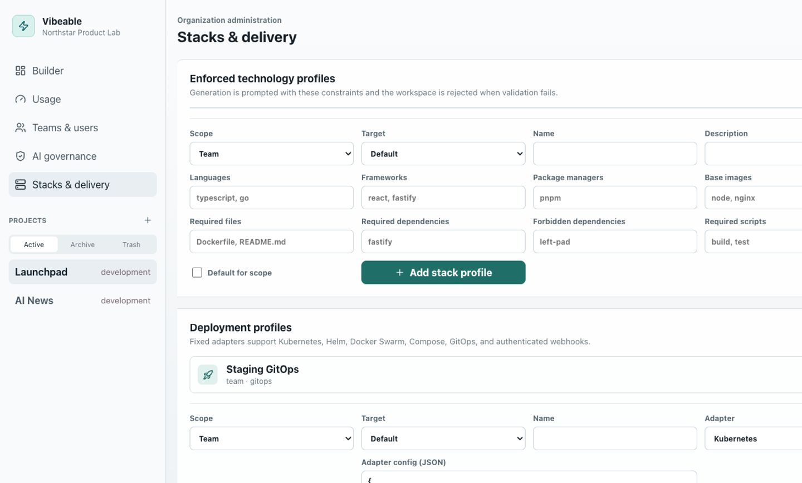
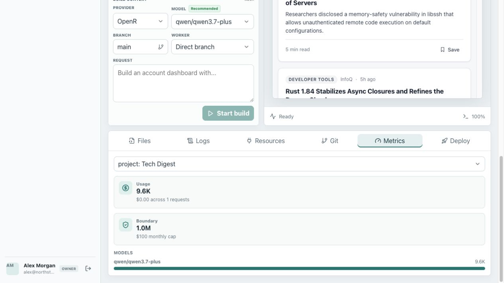
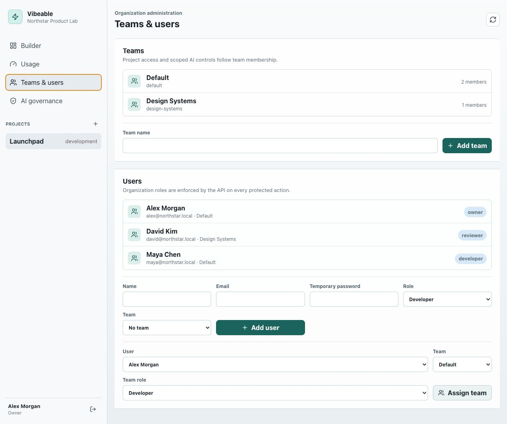
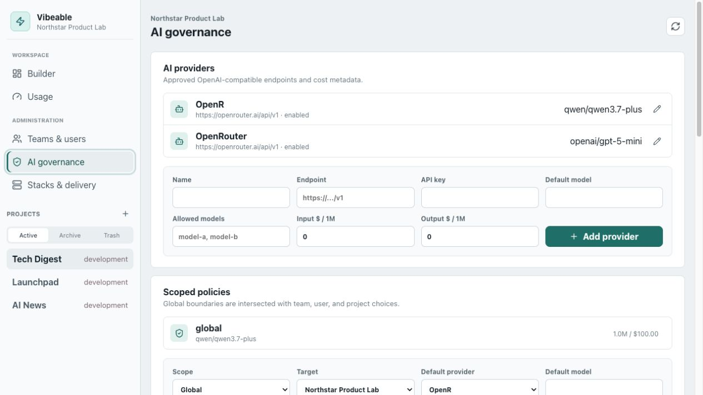

# Vibeable

Vibeable is a source-available, self-hosted, policy-aware AI application builder for organizations. It combines a conversational coding workflow and authenticated live preview with teams, RBAC, generic OIDC single sign-on, editable OpenAI-compatible providers, scoped prompt policies, managed project resources, usage accounting, and deployment approvals.

This repository is a self-hosted community edition, not a claim of feature-for-feature or security equivalence with Lovable. It is useful today for trusted company teams building web workspaces through an OpenAI-compatible endpoint. Read [Production readiness](docs/production-readiness.md) before allowing untrusted users or enabling command execution.

## Product tour

### Builder and live preview



### Technology and delivery governance



### Scoped token usage



### Teams and AI governance

<table>
  <tr>
    <td width="50%"></td>
    <td width="50%"></td>
  </tr>
</table>

Screenshots use local demo records and contain no production credentials.

## What works

- First-run organization and owner bootstrap, local password login, generic OIDC authorization-code SSO with PKCE, and opaque server-side sessions.
- Organization and team membership with owner, admin, developer, reviewer, and viewer roles.
- PostgreSQL-backed projects, runs, policies, hooks, usage, deployments, and audit events.
- OpenRouter or any compatible `/chat/completions` endpoint with encrypted API keys.
- Per-run provider and model dropdowns constrained by the effective policy, with the provider default identified as the recommended model; administrators can edit endpoints, models, prices, keys, and availability.
- Global, team, user, and project policy inheritance with hard provider/model intersections.
- Automatic lifecycle intent selection plus scoped prompt hooks and approval flags.
- Structured AI file edits with path traversal and binary/context limits.
- Git-backed projects with an agent branch and attributed commit for every successful run.
- Configurable HTTPS Git remotes, encrypted bearer/basic credentials, pull/push, mirror offload and restore, branch promotion, and branch-bound logical workers with optional auto-push.
- Active, archived, offloaded, and trash project views with guarded restore and owner-only permanent purge.
- Enforceable global, team, or project technology profiles for languages, frameworks, package managers, dependencies, required files/scripts, and container base images.
- Persisted progress, elapsed time, per-file events, reconnecting SSE, and polling fallback.
- Preview console/error capture and build logs fed into the next repair or agent pass as untrusted diagnostic context.
- Write-only project secrets, API/SMTP/service/Git metadata, and project-isolated managed PostgreSQL credentials.
- One automatic repair pass when workspace verification fails; every provider attempt is included in token and cost accounting.
- Authenticated live preview with desktop, tablet, and mobile sizing.
- Selectable global, team, user, and project token/cost dashboards.
- Team/project deployment profiles for Kubernetes, Helm, Docker Swarm, Compose, GitOps, or webhooks, with exact-commit plans, selected secret injection, event logs, health checks, production approval, execution, and rollback records.
- Docker Compose packaging, checksummed migrations, health checks, PostgreSQL integration tests, CI, and security documentation.

## Quick start with Docker

Requirements: Docker with Compose v2.

```bash
cp .env.compose.example .env
openssl rand -base64 32
```

Set `POSTGRES_PASSWORD`, `MASTER_KEY`, and `PUBLIC_URL` in `.env`, then run:

```bash
docker compose up --build
```

Open `http://localhost:8787`. The first browser creates the organization owner and AI provider. The example disables Secure cookies only for this local HTTP setup. Set `PUBLIC_URL` to an HTTPS URL and `COOKIE_SECURE=true` for every network deployment. Keep `EXECUTION_MODE=disabled` until you have reviewed the sandbox guidance.

## Local development

Requirements: Node.js 22+, pnpm 11, Git 2.28+, and PostgreSQL 15+.

```bash
cp .env.example .env
pnpm install
pnpm db:migrate
pnpm dev
```

The web UI runs at `http://127.0.0.1:5173`; the API runs at `http://127.0.0.1:8787`.

## Configuration

| Variable | Default | Purpose |
| --- | --- | --- |
| `DATABASE_URL` | local PostgreSQL | Primary database connection |
| `DATABASE_SSL` | `disable` | `disable`, `require`, or CA-verified `verify-full` |
| `MASTER_KEY` | development-only value | Encrypts provider API keys; mandatory to change in production |
| `PUBLIC_URL` | `http://127.0.0.1:8787` | Allowed browser origin and canonical URL |
| `COOKIE_SECURE` | production-dependent | Requires HTTPS for session cookies |
| `LOCAL_LOGIN_ENABLED` | `true` | Keeps local account login available for recovery |
| `OIDC_ENABLED` | `false` | Enables generic OIDC single sign-on; see [OIDC setup](docs/oidc.md) |
| `REQUIRE_SEPARATE_APPROVER` | `true` | Prevents users approving their own governed runs or deployments |
| `TRUST_PROXY` | `false` | Trust reverse-proxy forwarding headers |
| `EXECUTION_MODE` | `disabled` | `disabled`, `local`, or `docker` workspace verification |
| `DEPLOYMENT_EXECUTION_MODE` | `disabled` | `disabled` or `local` allowlisted deployment adapters |
| `ALLOW_PRIVATE_AI_ENDPOINTS` | `false` | Allows HTTP/private OpenAI-compatible endpoints |
| `DATA_DIR` | `.vibeable` | Project workspace storage |

`local` execution runs generated package scripts on the host and is only for a trusted developer machine. Shared installations should use a separately hardened Docker worker; see the threat model.

Static previews never receive secret values. Managed PostgreSQL creates an isolated role and schema; generated backends still require an application runtime worker. Deployment profiles receive only explicitly named resources. Keep deployment execution disabled in the default control-plane container: `local` adapters require operator-installed `kubectl`, `helm`, or `docker` binaries and should run in a dedicated worker. The webhook and GitOps adapters are the safer integration points for an existing deployment controller.

## Development commands

```bash
pnpm typecheck
pnpm test
pnpm build
pnpm check
```

The detailed product and API design remains in [SPEC.md](SPEC.md). The current implementation and its boundaries are documented in [Architecture](docs/architecture.md), [Threat model](docs/threat-model.md), and [Production readiness](docs/production-readiness.md). Production dependency licenses are reproduced in [THIRD_PARTY_NOTICES.md](THIRD_PARTY_NOTICES.md).

## Community

Vibeable is dual-licensed for perpetual internal company use or noncommercial community use. Commercial redistribution and hosted-service use require a separate license. Read [LICENSE](LICENSE) and [COMMERCIAL_LICENSE.md](COMMERCIAL_LICENSE.md) before use or distribution. Start contributions with [CONTRIBUTING.md](CONTRIBUTING.md), report vulnerabilities through [SECURITY.md](SECURITY.md), and follow the [Code of Conduct](CODE_OF_CONDUCT.md).
