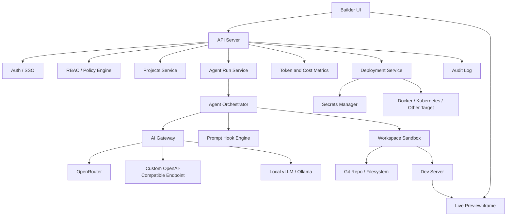

# Vibeable Product and Technical Specification

## 1. Overview

Vibeable is a self-hosted, company-controlled, Lovable-style application builder. Users create and modify applications through a chat-first interface while seeing a live visual preview, file changes, logs, tests, and deployment state in real time.

The platform is designed for internal company use with accounts, teams, RBAC, audit logs, approved stacks, configurable prompt hooks, pluggable AI providers, token/cost metrics, and governed deployment workflows.

## 2. Goals

- Provide a visual app-building experience similar to Lovable.
- Support self-hosted deployment inside a company-controlled environment.
- Allow users to build apps through natural language prompts.
- Show live previews of generated applications while they are being built.
- Store generated apps as real source code in Git-backed projects.
- Support accounts, organizations, teams, RBAC, and auditability.
- Support OpenRouter-style and arbitrary OpenAI-compatible AI endpoints.
- Allow AI configuration at global, team, user, and project scopes.
- Track token usage and estimated cost globally, per team, per user, per project, per provider, and per model.
- Allow configurable prompt hooks at key lifecycle stages, especially before deployment.
- Support approved templates, stacks, deployment recipes, and policy constraints.
- Keep generated code, secrets, deployments, and model usage governable by company admins.

## 3. Non-Goals for MVP

- Public SaaS billing.
- Marketplace for third-party templates.
- Drag-and-drop visual website builder.
- Full IDE replacement.
- Unlimited arbitrary deployment providers.
- Unrestricted user-supplied AI endpoints.
- Fully autonomous production deploys without policy controls.

## 4. Primary User Experience

The primary workspace has four main areas:

```txt
+--------------------------------------------------------------+
| Project, environment, model, token budget, deploy status      |
+---------------+------------------------------+---------------+
| Chat / Agent  | Live Preview                 | Files / Diffs |
|               |                              |               |
| User prompts  | App iframe                   | File tree     |
| Agent plan    | Device switcher              | Changed files |
| Run timeline  | Error overlay                | Diff viewer   |
+---------------+------------------------------+---------------+
| Terminal logs, tests, build output, deployment timeline       |
+--------------------------------------------------------------+
```

Core workflow:

1. User creates a project from an approved template.
2. User enters a prompt such as "Build an internal CRM with auth, contacts, companies, and notes."
3. The agent plans the change using the effective org/team/user/project AI policy.
4. The agent edits the project inside an isolated workspace sandbox.
5. The app preview updates as the dev server hot reloads.
6. The user reviews files, diffs, logs, and test/build output.
7. The user asks for follow-up changes or approves the result.
8. The system commits the accepted changes.
9. The user deploys to an allowed environment using a governed deployment workflow.

## 5. System Architecture



## 6. Core Services

### 6.1 Web App

Responsibilities:

- Chat interface.
- Live preview iframe.
- File tree.
- Diff viewer.
- Terminal, build, and test log panels.
- Agent run timeline.
- Project settings.
- AI provider/model selector, when permitted.
- Team and admin settings.
- Token and cost dashboards.
- Deployment controls and approvals.

Recommended implementation:

- Next.js or React.
- WebSocket or Server-Sent Events for run streaming.
- Monaco or CodeMirror for file viewing/editing.
- iframe preview with device-size controls.
- xterm.js or equivalent terminal log renderer.

### 6.2 API Server

Responsibilities:

- Users, organizations, teams, projects, environments.
- RBAC checks.
- AI policy resolution.
- Agent run creation and lifecycle.
- Prompt hook lookup.
- Usage event ingestion and aggregation.
- Deployment workflow orchestration.
- Audit log creation.
- Admin configuration APIs.

Recommended implementation:

- Node.js/NestJS, Fastify, or FastAPI.
- PostgreSQL for primary data.
- Redis for queues and ephemeral state.
- Object storage for artifacts and logs if needed.

### 6.3 Agent Orchestrator

Responsibilities:

- Create isolated agent runs.
- Resolve effective AI policy.
- Load relevant project context.
- Apply lifecycle prompt hooks.
- Invoke coding agent/model through the AI gateway.
- Execute file edits in sandbox.
- Run package installs, tests, builds, and dev server commands.
- Stream progress, patches, logs, and status to the UI.
- Emit token usage events.
- Produce reviewable diffs and commits.

### 6.4 Workspace Sandbox

Each project run executes in an isolated workspace.

Responsibilities:

- Clone or mount the project repo.
- Run dependency installation.
- Run dev server.
- Run tests, lint, typecheck, and builds.
- Expose preview through a controlled reverse proxy.
- Enforce CPU, memory, disk, network, and timeout limits.

Implementation options:

- MVP: Docker containers.
- Scale version: Kubernetes jobs/pods.
- Higher isolation: Firecracker, Kata Containers, or similar microVM runtime.

Default security posture:

- No direct production secret access.
- No internal network access unless allowlisted.
- Package installation allowed but logged and scanned.
- Workspace filesystem isolated per run.
- Preview exposed only to authorized project users.

### 6.5 AI Gateway

The AI gateway abstracts model providers from the rest of the system.

Supported provider types:

- OpenAI-compatible endpoints.
- OpenRouter.
- OpenAI direct.
- Azure OpenAI.
- Anthropic direct, if needed.
- Local vLLM.
- Local Ollama with OpenAI-compatible API.

Provider config:

```yaml
id: openrouter
type: openai-compatible
base_url: https://openrouter.ai/api/v1
api_key_secret_ref: secret_ai_openrouter
default_model: anthropic/claude-sonnet-4
allowed_models:
  - anthropic/claude-sonnet-4
  - openai/gpt-5
  - google/gemini-2.5-pro
extra_headers:
  HTTP-Referer: https://builder.company.com
  X-Title: Vibeable
supports:
  streaming: true
  tools: true
  vision: false
```

The system should not allow arbitrary users to add unreviewed AI endpoints by default. Admins define providers, and teams/users/projects select from allowed providers and models.

## 7. Accounts, Organizations, and Teams

Entities:

- Organization: top-level company account.
- Team: group inside an organization.
- User: authenticated person.
- Project: generated app/repo.
- Environment: dev, staging, production, or custom.

Auth requirements:

- Email/password optional for MVP.
- OIDC support.
- SAML support for enterprise environments.
- Compatible with Keycloak, Authentik, Zitadel, WorkOS, or similar.

## 8. RBAC

Default roles:

- Owner: full organization control.
- Admin: manage teams, templates, providers, secrets, policies, and deployments.
- Developer: create and modify projects, run agents, deploy when allowed.
- Reviewer: review changes and approve deployments.
- Viewer: read-only access.

Key permissions:

```txt
org:manage
team:create
team:update
team:delete
user:invite
project:create
project:read
project:update
project:delete
agent:run
agent:approve_changes
repo:commit
deployment:create
deployment:approve
deployment:rollback
secret:create
secret:update
secret:read_metadata
ai_provider:create
ai_provider:update
ai_policy:update
template:create
template:publish
metrics:read_global
metrics:read_team
metrics:read_user
audit:read
```

Recommended rule:

Higher-level policies set boundaries. Lower-level settings choose defaults inside those boundaries.

## 9. AI Policy Scopes

AI settings can exist at four scopes:

```txt
Global / Organization
Team
User
Project
```

Recommended precedence:

```txt
Project -> User -> Team -> Global
```

However, hard restrictions from higher scopes always apply. For example, a user can choose a preferred model only if that model is allowed by org and team policy.

Example global policy:

```yaml
scope: global
default_provider: openrouter
default_model: anthropic/claude-sonnet-4
allowed_providers:
  - openrouter
  - company-openai
  - local-vllm
allowed_models:
  - anthropic/claude-sonnet-4
  - openai/gpt-5
  - qwen3-coder
enforce_allowed_models: true
monthly_token_limit: 200000000
monthly_cost_limit_usd: 5000
```

Example team policy:

```yaml
scope: team
team_id: product
default_provider: openrouter
default_model: openai/gpt-5
allowed_providers:
  - openrouter
  - local-vllm
allowed_models:
  - openai/gpt-5
  - qwen3-coder
allow_user_override: true
monthly_token_limit: 40000000
monthly_cost_limit_usd: 1000
```

Example user policy:

```yaml
scope: user
user_id: user_123
default_provider: local-vllm
default_model: qwen3-coder
monthly_token_limit: 3000000
monthly_cost_limit_usd: 100
```

Example project policy:

```yaml
scope: project
project_id: project_123
default_provider: openrouter
default_model: anthropic/claude-sonnet-4
required_for_phases:
  deploy_prepare:
    provider: company-openai
    model: openai/gpt-5
```

## 10. AI Policy Resolution

Every agent run resolves an effective policy before the first model call.

Input:

```ts
interface PolicyResolutionInput {
  orgId: string;
  teamId?: string;
  userId: string;
  projectId?: string;
  phase: AgentPhase;
}
```

Output:

```ts
interface EffectiveAiPolicy {
  providerId: string;
  model: string;
  baseUrl: string;
  apiKeySecretRef: string;
  allowedProviders: string[];
  allowedModels: string[];
  monthlyTokenLimit?: number;
  monthlyCostLimitUsd?: number;
  requireApproval: boolean;
  promptHooks: PromptHook[];
}
```

Resolution rules:

1. Start with global defaults and constraints.
2. Apply team defaults if present and permitted by global constraints.
3. Apply user defaults if user overrides are allowed.
4. Apply project defaults if present.
5. Apply phase-specific routing rules if present.
6. Reject the run if the selected provider/model violates any hard constraint.
7. Reject or reroute the run if global, team, user, or project budget is exhausted.

## 11. Prompt Hooks

Prompt hooks allow admins to inject instructions at specific lifecycle phases.

Supported phases:

```txt
project:create
agent:before_plan
agent:before_edit
agent:after_edit
agent:after_error
agent:before_test
agent:after_test_failure
deploy:prepare
deploy:preflight
deploy:post_success
deploy:post_failure
```

Prompt hook example:

```yaml
id: deploy_prepare_company_node
scope: global
phase: deploy:prepare
enabled: true
priority: 100
prompt: |
  Before deployment, ensure the app follows company deployment standards:
  - Dockerfile exists and uses the approved Node base image.
  - /api/health returns 200 without requiring authentication.
  - Public frontend environment variables do not contain secrets.
  - Database migrations are committed and reversible.
  - OpenTelemetry is configured.
  - The build, lint, and test commands pass.
```

Hook behavior:

- Hooks are ordered by scope and priority.
- Global hooks can be marked mandatory.
- Team/project hooks can extend but not override mandatory global hooks.
- Hook application is recorded in the audit log.
- Every agent run stores which hooks were applied.

## 12. Templates and Approved Stacks

Projects should start from approved templates.

Template fields:

```yaml
id: nextjs-internal-app
name: Next.js Internal App
description: Internal business application using Next.js and PostgreSQL.
repo_template: git@example.com:templates/nextjs-internal.git
default_branch: main
package_manager: pnpm
dev_command: pnpm dev
build_command: pnpm build
test_command: pnpm test
lint_command: pnpm lint
allowed_deployment_targets:
  - docker
  - kubernetes
required_files:
  - Dockerfile
  - .dockerignore
  - package.json
prompt_hooks:
  project:create: prompts/create.md
  deploy:prepare: prompts/deploy.md
```

Initial template set:

- Next.js internal app.
- React/Vite single-page app.
- FastAPI backend.
- Full-stack React plus FastAPI plus PostgreSQL.
- Static marketing site.
- Internal dashboard.

## 13. Live Preview

Each active project session can expose a live preview.

Requirements:

- Start the template's configured dev server inside the sandbox.
- Route preview traffic through the platform reverse proxy.
- Protect preview URLs with project authorization.
- Support hot reload when the framework supports it.
- Support desktop, tablet, and mobile viewport controls.
- Show dev server status.
- Show browser/runtime errors in the workspace UI.
- Allow preview restart.

Preview URL model:

```txt
https://builder.company.com/projects/:projectId/preview/:sessionId
```

or:

```txt
https://preview-:sessionId.builder.company.com
```

The first approach is simpler for self-hosting. The second approach better matches production-like host behavior but needs wildcard DNS and certificates.

## 14. Git and Code Review Flow

Every project is backed by Git.

Flow:

1. Create project repo from template.
2. Create an agent branch for each run.
3. Apply edits inside the sandbox.
4. Stream changed files and diffs.
5. Run checks.
6. User accepts or rejects changes.
7. Accepted changes are committed.
8. Deployment is built from committed source.

Recommended branch format:

```txt
agent/:runId/:short-description
```

Commit metadata should include:

- User ID.
- Agent run ID.
- Provider ID.
- Model.
- Prompt hook IDs.
- Token usage summary.

## 15. Deployment Workflow

Deployment is governed and policy-driven.

Lifecycle:

1. User requests deployment.
2. System resolves deployment policy.
3. Agent runs `deploy:prepare` prompt hooks if required.
4. System runs preflight checks:
   - dependency install
   - lint
   - tests
   - typecheck
   - build
   - secret scan
   - Docker image build, when relevant
   - database migration review, when relevant
5. Human approval is requested if policy requires it.
6. Deployment is executed.
7. Health checks run.
8. Deployment record and logs are saved.

Supported MVP target:

- Docker-based deployment.

Future targets:

- Kubernetes.
- AWS ECS.
- Google Cloud Run.
- Azure Container Apps.
- Nomad.
- Existing internal platform adapter.

## 16. Secrets

Secrets must never be freely exposed to the model.

Requirements:

- Store secrets in Vault, Infisical, Doppler, cloud secret manager, or encrypted database storage.
- Agents can request secret metadata but not raw values by default.
- Runtime and deployment jobs receive secret values through controlled injection.
- Secret reads and writes are audited.
- User-facing UI shows secret names, scopes, environments, and last changed metadata.
- Production secret access requires stronger permissions than development secret access.

## 17. Token and Cost Metrics

Every model request emits an immutable usage event.

```ts
interface TokenUsageEvent {
  id: string;
  orgId: string;
  teamId?: string;
  userId: string;
  projectId?: string;
  runId?: string;
  phase: AgentPhase;
  providerId: string;
  model: string;
  inputTokens: number;
  outputTokens: number;
  cacheReadTokens?: number;
  cacheWriteTokens?: number;
  reasoningTokens?: number;
  totalTokens: number;
  estimatedCostUsd?: number;
  requestStartedAt: string;
  requestCompletedAt: string;
}
```

Supported metric views:

- Global/org usage.
- Team usage.
- User usage.
- Project usage.
- Provider usage.
- Model usage.
- Run usage.
- Phase usage.
- Daily, weekly, and monthly rollups.

Dashboards:

- Org admins see all usage.
- Team admins see team usage.
- Users see their own usage where policy allows.
- Project maintainers see project usage.

Required metrics:

- Total tokens.
- Input tokens.
- Output tokens.
- Estimated cost.
- Usage by provider.
- Usage by model.
- Usage by team.
- Usage by user.
- Usage by project.
- Budget remaining.
- Budget burn rate.
- Number of successful and failed agent runs.

## 18. Budgets and Limits

Budgets can be set at global, team, user, and project scopes.

Examples:

```yaml
global:
  monthly_token_limit: 200000000
  monthly_cost_limit_usd: 5000

team:
  monthly_token_limit: 40000000
  monthly_cost_limit_usd: 1000

user:
  monthly_token_limit: 3000000
  monthly_cost_limit_usd: 100

project:
  monthly_token_limit: 10000000
  monthly_cost_limit_usd: 250
```

Enforcement:

- Hard limits block new model requests.
- Soft limits warn users and admins.
- Routing rules can move low-risk phases to cheaper models.
- Admins can configure grace behavior by scope.

## 19. Model Routing Rules

Routing rules choose provider/model based on task phase, cost, risk, or policy.

Example:

```yaml
routing:
  default:
    provider: openrouter
    model: anthropic/claude-sonnet-4

  cheap_tasks:
    phases:
      - summarize_logs
      - classify_error
      - generate_commit_message
    provider: local-vllm
    model: qwen3-coder

  high_risk_tasks:
    phases:
      - database_migration
      - production_deploy_prepare
    provider: company-openai
    model: openai/gpt-5
    require_approval: true
```

## 20. Audit Log

Audit events should be immutable.

Events:

- User login.
- Team membership changes.
- RBAC changes.
- AI provider changes.
- AI policy changes.
- Prompt hook changes.
- Template changes.
- Agent run started/completed/failed.
- Model selected.
- Prompt hooks applied.
- Files changed.
- Commit created.
- Secret created/updated/deleted.
- Deployment requested/approved/completed/failed.
- Budget changed.

## 21. Data Model

Minimum tables:

```txt
organizations
users
teams
team_members
roles
permissions
role_assignments
projects
project_members
project_repositories
project_environments
templates
template_versions
ai_providers
ai_models
ai_policies
ai_policy_assignments
prompt_hooks
agent_runs
agent_run_events
agent_run_files
token_usage_events
token_usage_daily_rollups
budgets
secrets
deployments
deployment_events
audit_events
```

Important assignment model:

```ts
type ScopeType = "global" | "team" | "user" | "project";

interface PolicyAssignment {
  id: string;
  policyId: string;
  scopeType: ScopeType;
  scopeId: string;
}
```

## 22. API Surface

Representative endpoints:

```txt
POST   /api/projects
GET    /api/projects
GET    /api/projects/:id
PATCH  /api/projects/:id

POST   /api/projects/:id/runs
GET    /api/projects/:id/runs
GET    /api/runs/:runId
GET    /api/runs/:runId/events
POST   /api/runs/:runId/approve
POST   /api/runs/:runId/reject

GET    /api/projects/:id/files
GET    /api/projects/:id/diff

POST   /api/projects/:id/preview/start
POST   /api/projects/:id/preview/restart
GET    /api/projects/:id/preview/status

POST   /api/projects/:id/deployments
GET    /api/projects/:id/deployments
POST   /api/deployments/:id/approve
POST   /api/deployments/:id/rollback

GET    /api/admin/ai/providers
POST   /api/admin/ai/providers
PATCH  /api/admin/ai/providers/:id
GET    /api/admin/ai/policies
POST   /api/admin/ai/policies
PATCH  /api/admin/ai/policies/:id

GET    /api/metrics/usage
GET    /api/metrics/usage/global
GET    /api/metrics/usage/teams/:teamId
GET    /api/metrics/usage/users/:userId
GET    /api/metrics/usage/projects/:projectId
```

## 23. MVP Milestones

### Milestone 1: Foundation

- Authentication.
- Organizations.
- Teams.
- Basic RBAC.
- Project creation from one template.
- PostgreSQL schema.
- Audit log foundation.

### Milestone 2: Agent Runs

- Agent run lifecycle.
- Sandbox creation.
- Git-backed project checkout.
- OpenAI-compatible provider support.
- Streaming run events.
- File changes and diff viewer.
- Token usage events.

### Milestone 3: Live Preview

- Dev server management.
- Reverse proxy to preview.
- Preview iframe.
- Device viewport controls.
- Runtime/build error display.
- Restart preview.

### Milestone 4: Policies and Prompt Hooks

- Global/team/user/project AI policy scopes.
- Effective policy resolution.
- Admin-managed AI providers.
- Prompt hook engine.
- Budget enforcement.
- Token usage dashboards.

### Milestone 5: Deployment

- Docker deployment target.
- Deployment preflight checks.
- `deploy:prepare` hook.
- Human approval flow.
- Secret injection.
- Health check.
- Deployment history.

### Milestone 6: Hardening

- Stronger sandbox isolation.
- Network allowlists.
- Secret scanning.
- Dependency policy scanning.
- Project-level access controls.
- Rollups and cost reporting.
- Template versioning.

## 24. Key Product Decisions

Recommended defaults:

- Admins define AI providers.
- Users choose only from approved providers and models.
- Global policies define hard boundaries.
- Team, user, and project settings define defaults inside those boundaries.
- Production deploys require approval by default.
- Deployment uses committed Git state only.
- Secrets are injected into runtime/deploy jobs, not exposed to models.
- Every model request emits token usage metrics.
- Every major action emits audit events.

## 25. Open Questions

- Should projects be stored in an internal Git service, an embedded Git server, or user-provided repositories?
- Should the first deployment target be Docker Compose, Kubernetes, or an existing internal platform?
- Which auth provider should be used first: Keycloak, Authentik, Zitadel, WorkOS, or custom OIDC?
- Should user-level AI overrides be enabled by default or only per team?
- Should arbitrary custom AI endpoints be allowed only globally, or also at team scope?
- Should local models be treated as zero-cost in reporting, or assigned internal compute cost estimates?
- What is the required sandbox isolation level for production use?
- Which initial templates should be supported?
