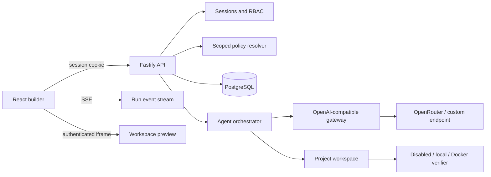

# Architecture

Vibeable is a single deployable control plane with a PostgreSQL database and project workspaces on durable storage.

## Trust boundaries

- The browser never receives provider credentials. Sessions are opaque, hashed in PostgreSQL, HttpOnly, SameSite Strict, and Secure in production.
- Every project query includes organization and team access constraints. API handlers enforce permissions before mutations.
- Provider responses are untrusted. The orchestrator accepts one bounded JSON schema, rejects unsafe paths and symlinks, and limits file count and size.
- Preview content is served from an authenticated endpoint in a sandboxed iframe with a restrictive content security policy.
- Command execution is off by default. Docker mode applies resource limits, removes capabilities, disables networking, and sets `no-new-privileges`.

## Policy resolution

Policies are evaluated global to team to user to project. Allowed provider and model sets are intersected, so narrower scopes cannot escape global boundaries. Defaults may become more specific, while token and cost limits select the strictest value. A missing global policy or empty intersection fails closed.

Prompt hooks matching the run phase are gathered from every applicable scope and ordered by descending priority. Mandatory hooks are not removable by narrower scopes.

## Run lifecycle

1. The API authorizes a project run and stores it as queued.
2. The orchestrator resolves policy and checks current-month usage.
3. It loads bounded text context from the project workspace.
4. The selected endpoint returns structured whole-file edits.
5. Path-safe edits are applied and persisted as run file metadata.
6. Verification follows the configured execution mode.
7. Usage and estimated cost are recorded from provider-reported token counts.
8. Events are persisted and streamed. Reconnecting clients replay prior events.

The in-process orchestrator is suitable for one control-plane replica. Horizontal scaling requires a durable queue and dedicated workers before multiple replicas are started.
