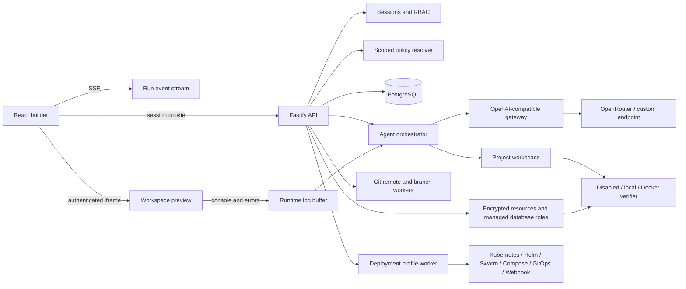

# Architecture

Vibeable is a single deployable control plane with a PostgreSQL database and project workspaces on durable storage.

## Trust boundaries

- The browser never receives provider credentials. Sessions are opaque, hashed in PostgreSQL, HttpOnly, SameSite Strict, and Secure in production.
- Every project query includes organization and team access constraints. API handlers enforce permissions before mutations.
- Provider responses, workspace files, and captured application logs are untrusted. The orchestrator accepts one bounded JSON schema, rejects unsafe paths and symlinks, excludes common credential files from context, and limits file count and size.
- Preview content is served from an authenticated endpoint in a sandboxed iframe with a restrictive content security policy.
- Command execution is off by default. Docker mode applies resource limits, removes capabilities, disables networking, and sets `no-new-privileges`.

## Policy resolution

Policies are evaluated global to team to user to project. Allowed provider and model sets are intersected, so narrower scopes cannot escape global boundaries. Defaults may become more specific, while token and cost limits select the strictest value. A missing global policy or empty intersection fails closed.

Prompt hooks matching the run phase are gathered from every applicable scope and ordered by descending priority. Mandatory hooks are not removable by narrower scopes.

## Run lifecycle

1. The API authorizes a project run and stores it as queued or waiting for independent approval.
2. The orchestrator resolves policy and checks current-month usage.
3. It loads bounded text context, resource names, and recent redacted build/preview logs.
4. The selected endpoint returns structured whole-file edits.
5. Existing workspace changes are checkpointed, then a run-specific Git branch is created from the selected project or worker branch and path-safe edits are applied one file at a time.
6. The effective stack profile is validated, then verification follows the configured execution mode with resource values injected into the verifier environment.
7. Provider usage is persisted after every attempt, including attempts followed by failed verification.
8. Failed verification logs are sent through one repair pass; secrets are redacted before storage or model feedback.
9. Successful edits are committed with run, user, provider, model, and usage metadata, fast-forwarded to the target branch, and optionally pushed to the configured remote.
10. Events are persisted and streamed. Reconnecting clients replay prior events, with client polling as a fallback.

The in-process orchestrator is suitable for one control-plane replica. Horizontal scaling requires a durable queue and dedicated workers before multiple replicas are started.

## Delivery lifecycle

Deployment profiles are scoped to a team or project and use a strict adapter-specific schema. A deployment resolves a branch to an exact commit, validates referenced workspace paths and endpoints, and snapshots the profile name, adapter configuration, and selected resource names into an immutable plan. Production plans require an independent approver. Execution checks out the recorded commit into a detached worktree, injects only the snapshotted resources, runs a fixed adapter command without a shell, records bounded redacted output, and performs an optional pinned health check. Rollback creates a new governed deployment for the prior successful commit.

Projects can be archived in place or mirrored to Git and offloaded from workspace storage. Trash is reversible; permanent purge is owner-only and removes managed resources, database records, and workspace data.
